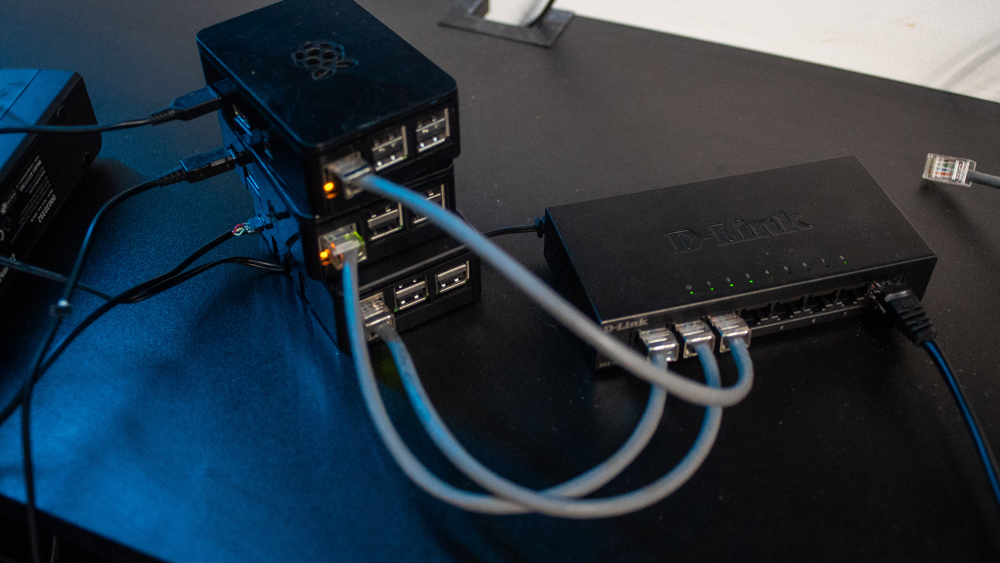
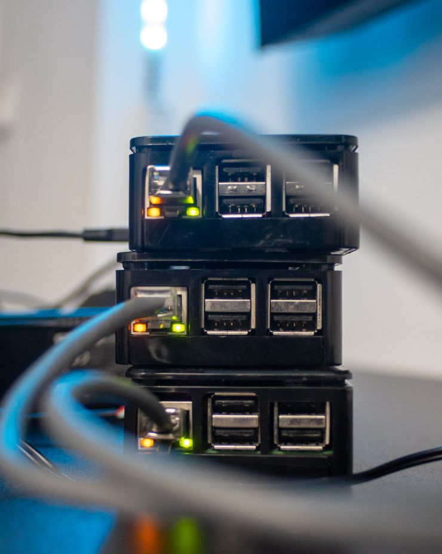

# Goals of this project
- Utilise unused hardware - 2 x Raspberry pi 3B+ and 1 x Raspberry pi 2B. Don't we all have raspberries just sitting around ?
- Learn more about networking - networking is a very broad field and some extra knowledge won't hurt.
- Learn about k8s and specifically ~~microk8s~~ k3s - kubernetes is something I've wanted to play for a long time, but now I have the chance and time to mess around. my first approach was microk8s, but they were too heavy and I had a lot of issues with connecting, so I've switched to k3s.
- Start my home lab - a goal that I had for a long time and didn't have the time to commit to it. Ideally I would like to expand my lab and do more things
- And just have fun in the process.


---

# The setup

~~I'll be following this guide to get started [How to build a Raspberry Pi Kubernetes cluster using MicroK8s](https://ubuntu.com/tutorials/how-to-kubernetes-cluster-on-raspberry-pi#1-overview) which looks pretty straightfoward - building and setting up the cluster.~~
So after a few hours of suffering and pain I've ditched microk8s and went to k3s which worked in the first 5 minutes and it's a way lighter than microk8s. I've followed this guide [How to build a Raspberry Pi Kubernetes Cluster with k3s](https://medium.com/thinkport/how-to-build-a-raspberry-pi-kubernetes-cluster-with-k3s-76224788576c)

My cluster is **really ghetto** at the moment, but with time I'll 3D print some holders, maybe a rack and that exposed USB will be gone.




I'm going with Ubuntu server and sadly I see this warning: 
Which means that the Pi 2B will not be part of the cluster, since It can't support 64-bit systems. I'll have to find another use for it probably monitoring or something. (This part still stands true, sadly).


After 25 minutes I had two working nodes master and worker and a client. 

```
ubuntu@k3master:~$ sudo kubectl get nodes
NAME       STATUS   ROLES                  AGE   VERSION
k3master   Ready    control-plane,master   19m   v1.25.7+k3s1
worker     Ready    <none>                 15m   v1.25.7+k3s1
```
Super happy with the results, so far. 



---
# Experimenting 

- I've actually added the pi2b+ to the cluster, hopefully it would be able to keep up and it's probably a bad idea, but I'm learning so I don't care that much.


 
- Another thing managing - 3 raspberrys is a pain, so I've started using  Ansible. It's super great for basic tasks like rebooting or checking something on the whole cluster and I'm *barely* scratching the surfrace. I've never used it, but I can see myself using it for things like this. I've wrote a very basic inventory file 

```
[master]
192.168.1.10

[workers]
192.168.1.[11:12]

[kluster:children]
master
workers

[kluster:vars]
ansible_user
ansible_password
```
Most important thing is to see how to manage passwords and users.